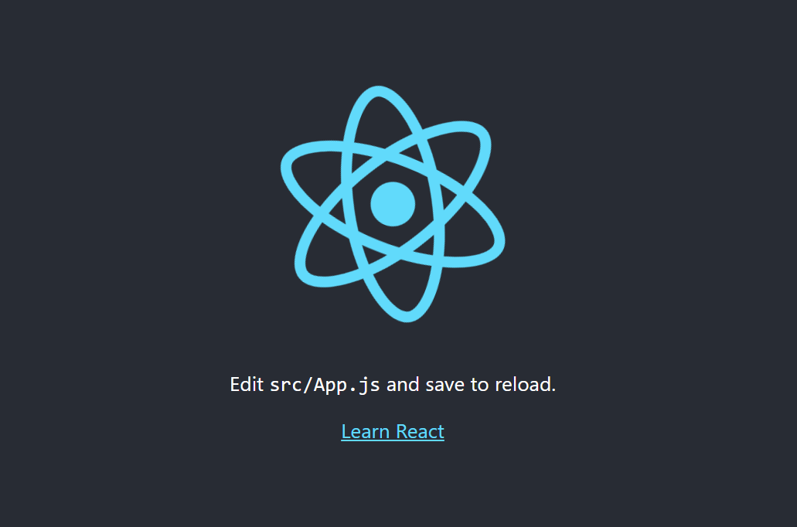
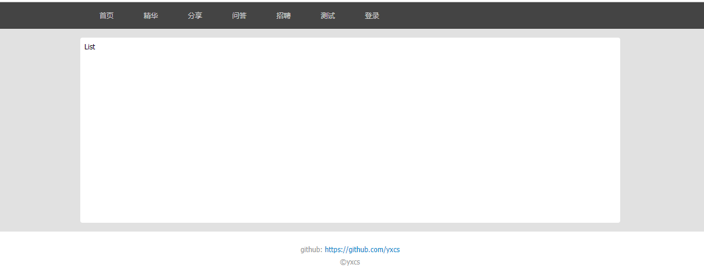

### 项目介绍
使用 create-react-app 构建一个 react 项目的基础架构  
包括: 
- react-router4.0 的使用 
- - axios 获取远程api内容
- 从 flux -> redux -> redux-sage 迁移转变的过程，mobx 本教程并未涉及，有兴趣的自己去了解一下
- antd UI 组件的添加
- ...
### 项目安装
```shell
git clone ''  
cd react-state-machine  
npm i  
npm start  
```
可以直接在 github 上拷贝这个项目
同时，也可以按照我搭建的过程，一步一步的跟着构建

### 基础项目搭建
确保你的电脑上安装了 npm 和 node  
1. 首先需要全局安装 reate-react-app 
   ```shell
    npm install -g create-react-app
   ```
   or
   ```shell
    npm install -g yarn  
    yarn add -g create-react-app
   ```
   完成之后，就开始生成一个react项目
   ```shell
    create-react-app react-state-machine
    cd react-state-machine
    npm start
   ```
   需要等待一会儿，会自动把需要的插件安装好，插件包括 react, react-dom, react-scripts。这个时候我们可以看到，项目已经运行了，在浏览器中打开项目，地址为 http://localhost:3000/ (默认端口 3000)，你会看到一个旋转的logo。  
     
2. 现在我们已经有了一个基础的react项目了，但是目前只有一个url http://localhost:3000/ 没有其他的了。以前的路由是由后端控制的，每个路由对应一个单独的页面，切换路由就可以在服务器上拿到不同的页面了，但是 react 框架一般是用来实现单页面应用的，即 SPA，那么它的路由就与传统的有些不同。它是由 H5 的history控制的，对应的不是页面而是组件。  
   为了实现前端路由，这里使用了 React-router
   React-router 提供了一些router的核心api，包括Router, Route, Switch等，但是它没有提供dom操作进行跳转的api。
   而 React-router-dom 提供了BrowserRouter, Route, Link等api ,我们可以通过dom的事件控制路由。例如点击一个按钮进行跳转，大多数情况下我们是这种情况，所以在开发过程中，我们更多是使用React-router-dom。
   ```shell
    npm i react-router-dom
   ```
   React-router-dom 的两个基础组件：HashRouter 和 BrowserRouter
   HashRouter：以hash值来对路由进行控制，路由是这样的 http://localhost:3000/#/test
   BrowserRouter：HashRouter这样的路由很奇怪，和我们平时看到的不一样，如果想和以前的保持一样，那么，就用BrowserRouter来实现。它的原理是使用HTML5 history API (pushState, replaceState, popState)来使你的内容随着url动态改变的， 如果是个强迫症或者项目需要就选择BrowserRouter吧。
   - 在src/目录下新建一个目录components/用于存放各种组件，在src/components/下新建多个文件，如下：
    ```html
    src
      |- components
        |- Article.js
        |- Author.js
        |- Content.js
        |- Footer.js
        |- Header.js
        |- List.js
        |- Login.js 
    ```
    接下来我们开始改造 src/App.js 文件。将原有代码删除，将以下代码添加到App.js中：
    ```javascript
        import React, { Component } from 'react';
        import { BrowserRouter } from 'react-router-dom';

        import Article from './components/Article';
        import Author from './components/Author';
        import Content from './components/Content';
        import Footer from './components/Footer';
        import Header from './components/Header';
        import List from './components/List';
        import Login from './components/Login';

        class App extends Component {
            constructor(props) {
                super(props);
            }

            render() {
                return (
                    <BrowserRouter></BrowserRouter>
                )
            }
        }

        export default App;
    ```
    从 react-router-dom 中引入 BrowserRouter，并将其在render中返回，导入components中的组件。接下来是添加router的主要内容:  

    App.js  
    ```javacript
        return (
        <BrowserRouter>
            <div>
            <Header></Header> {/* 头部导航内容 */}
            <Content>         {/* Content来规范主题内容的整体样式，包含路由内容 */}
                <Switch>        {/* 用来渲染匹配地址的第一个<Route>或者<Redirect> */}
                <Redirect exact from="/" to="/home/all" />              {/* <Redirect> 跳转到home */}
                <Redirect exact from="/home" to="/home/all" />
                <Route path='/home/:tab' component={List}></Route>       {/* 匹配路由为 /home 的请求，显示List组件 */}
                <Route path='/article/:id' component={Article}></Route>
                <Route path='/author/:id' component={Author}></Route>
                <Route path='/login' component={Login}></Route>
                </Switch>
            </Content>
            <Footer></Footer> {/* 页脚 © copyright等信息 */}
            </div>
        </BrowserRouter>
        )
    ```
    Content.js  
    ```javascript
        import React, { Component } from 'react';

        class Content extends Component {
            constructor(props) {
                super(props);
            }

            render() {
                return (
                <div>
                    Content
                    {this.props.children}
                </div>
                )
            }
        }

        export default Content;
    ```
    List.js 和 components下的其他js文件(将List替换成其他的组件名即可)
    ```javascript
        import React, { Component } from 'react';

        class List extends Component {
            constructor(props) {
                super(props);
            }

            render() {
                return (
                    <div>
                        List
                    </div>
                )
            }
        }

        export default List;
    ```
    这时我们打开 http://localhost:3000/，会自动跳到 http://localhost:3000/home，显示的内容如下：
    
      

    有点丑啊，加点样式吧，在 App.js 中添加 import './App.css';，在App.css中加入相应样式，在Header.js中添加一些导航信息:
    ```javascript
        import React, { Component } from 'react';
        import { Link } from 'react-router-dom';
        class Header extends Component {
            constructor(props) {
                super(props);
            }

            render() {
                return (
                <div className="header__wrap">
                    <div className="header__menu">
                    <div><Link to="/home/all">首页</Link></div>
                    <div><Link to="/home/good">精华</Link></div>
                    <div><Link to="/home/share">分享</Link></div>
                    <div><Link to="/home/ask">问答</Link></div>
                    <div><Link to="/home/job">招聘</Link></div>
                    <div><Link to="/home/test">测试</Link></div>
                    <div><Link to="/login">登录</Link></div>
                    </div>
                </div>
                )
            }
        }

        export default Header;
    ```
    效果如下:

        

    点击头部导航切换不同的路由，再添加页面时只需在App.js中添加新的 Route 就好了

3. 现在有一个问题，页面都是空的没有任何数据，这里我们调用 [Cnode 社区](https://cnodejs.org/ "Cnode 社区") 的开放的API来填充我们的项目
   这里使用axios来调用远程API
   ```shell
    npm i axios
   ```
   在src下新建config.js文件和services/apis.js文件
   config.js
   ```javascript
    // 基础URl
    export const BASE_URL = 'https://cnodejs.org/api/v1';
  ```
  在services/apis.js中添加所有用到的api，具体的内容和传参等请 [点击这里](https://cnodejs.org/api "Cnode Api") 查看：
  apis.js
  ```javascript
    import axios from 'axios';
    import { BASE_URL } from '../config';

    const filterNullParams = (params) => {
        let newParams = {};
        let isArray = false;
        Object.keys(params).forEach(key => {
            isArray = Object.prototype.toString.call(params[key]).indexOf('Array') !== -1;
            if ( (isArray &&
            params[key].length >0) ||
            (!isArray && (!!params[key] ||
            params[key] === 0 ||
            params[key] === false)) ) {
            newParams[key] = params[key];
            }
        });
        return newParams;
    }

    const params2String = (params) => {
        let str = '';
        for (let key in params) {
            str += `&${key}=${params[key]}`
        }
        str = str.replace('&', '');
        return str;
    }

    //get /topics 主题首页
    export const getTopics = (params) => {
        const newParams = filterNullParams(params);
        const str = params2String(newParams);
        return axios.get(`${BASE_URL}/topics`, {
            ...newParams
        })
    }
  ```
  在 List.js 中调用apis.js 中的函数，获取相应数据：
  ```javascript
    import React, { Component } from 'react';
    import { getTopics } from '../services/apis';
    class List extends Component {
        constructor(props) {
            super(props);
        }

        componentWillMount() {
            const params = {
            page: 1,
            tab: 'all',
            limit: 40,
            mdrender: true
            }
            getTopics(params).then(res => {
                console.log(res)  // 输出返回的数据
            })
        }

        render() {
            return (
            <div className="list__wrap">
                
            </div>
            )
        }
    }

    export default List;
  ```

4. 数据有了，还缺展示数据的样式，可以添加react的UI组件，这里添加的是 antd
   ```shell
    npm i antd --save                      # antd UI 组件
    npm i react-app-rewired --save-dev     # 使用 react-app-rewired 对create-react-app进行配置
    npm i babel-plugin-import --save-dev   # 按需加载
    npm i react-app-rewire-less --save-dev # 增加less支持， 更改主题颜色等
   ```
   在src下面新建 config-overrides.js，并添加配置设置
   ```javascript
    const { injectBabelPlugin } = require('react-app-rewired');
    const rewireLess = require('react-app-rewire-less');

    module.exports = function override(config, env) {
        config = injectBabelPlugin(
            ['import', { libraryName: 'antd', libraryDirectory: 'es', style: true }], // change importing css to less
            config,
        );
        config = rewireLess.withLoaderOptions({
                modifyVars: { "@primary-color": "#1DA57A" },
                javascriptEnabled: true,
            })(config, env);
        return config;
    };
    ```
    更改package.json中项目启动脚本
    ```json
    "scripts": {
        "start": "react-app-rewired start",
        "build": "react-app-rewired build",
        "test": "react-app-rewired test",
        "eject": "react-scripts eject"
    }
    ```
    antd的环境已经搭建好了，在List中尝试使用一下：
    ```javascript
    import React, { Component } from 'react';
    import { getTopics } from '../services/apis';
    import { Avatar } from 'antd';                 // 引入 Avatar 组件
    class List extends Component {
        constructor(props) {
            super(props);
        }

        componentWillMount() {
            const params = {
            page: 1,
            tab: 'all',
            limit: 40,
            mdrender: true
            }
            getTopics(params).then(res => {
            console.log(res)
            })
        }

        render() {
            return (
            <div className="list__wrap">
                <Avatar src="https://zos.alipayobjects.com/rmsportal/ODTLcjxAfvqbxHnVXCYX.png" /> {/* 调用 Avatar， 这是会在页面看到一个头像 */}
            </div>
            )
        }
    }

    export default List;
    ```
    在List中添加样式和dom、组件等，配合之前获取到的数据来渲染列表，最后的效果如下：

    

5. 这时我们会发现一个问题，<Header> 和 <List> 并不是父子组件，那么他们之间的数据传递通过props的话，会很复杂，那么有没有比较简单切通用的方法那？当然有的，例如Flux。
   简单说，Flux 是一种架构思想，专门解决软件的结构问题。它跟MVC 架构是同一类东西，但是更加简单和清晰。  
   Flux存在多种实现[（至少15种）](https://github.com/voronianski/flux-comparison)，我使用的是[Facebook官方实现](https://github.com/facebook/flux)。  
   首先，Flux将一个应用分成四个部分。
   - View： 视图层
   - Action（动作）：视图层发出的消息（比如mouseClick）
   - Dispatcher（派发器）：用来接收Actions、执行回调函数
   - Store（数据层）：用来存放应用的状态，一旦发生变动，就提醒Views要更新页面
   
   

   Flux 的最大特点，就是数据的"单向流动"。 
   * 用户访问 View
   * View 发出用户的 Action
   * Dispatcher 收到 Action，要求 Store 进行相应的更新
   * Store 更新后，发出一个"change"事件
   * View 收到"change"事件后，更新页面  
   上面过程中，数据总是"单向流动"，任何相邻的部分都不会发生数据的"双向流动"。这保证了流程的清晰。
   首先安装需要用到的插件，然后在src文件夹下新建fluxStore文件夹，在fluxStore下新建文件actions.js、store.js、dispatcher.js用于存放flux相关内容，
   ```shell
    npm i events object-assign flux --save
   ```
   actions.js
   ```javascript
    import AppDispatcher from './dispatcher';

    const onTabChange = (text) => {
        AppDispatcher.dispatch({
            actionType: 'TAB_CHANGE',
            text: text
        });
    }
    export default onTabChange;
   ```
   store.js
   ```javascript
    const EventEmitter = require('events').EventEmitter;
    const assign = require('object-assign');

    const TabStore = assign({}, EventEmitter.prototype, {
        tab: 'all',

        getTab: function () {
            return this.tab;
        },
        tabChange: function (text) {
            this.tab = text;
        },

        emitChange: function () {
            this.emit('change');
        },

        addChangeListener: function(callback) {
            this.on('change', callback);
        },

        removeChangeListener: function (callback) {
            this.removeListener('change', callback);
        }
    });

    export default TabStore;
   ```
   dispatcher.js
   ```javascript
    import Flux from 'flux';
    import TabStore from './store';
    const Dispatcher = Flux.Dispatcher;
    const AppDispatcher = new Dispatcher();

    AppDispatcher.register(function (action) {
        switch(action.actionType) {
            case 'TAB_CHANGE':
            TabStore.tabChange(action.text);
            TabStore.emitChange();
            break;
            default:
            // no op
        }
    })

    export default AppDispatcher;
   ```
   当Flux构建好了之后，我们将之引入到需要使用的地方，
   Header.js
   ```javascript
    import React, { Component } from 'react';
    import { Link } from 'react-router-dom';

    import TabStore from '../fluxStore/store';
    import onTabChange from '../fluxStore/actions';

    class Header extends Component {
        constructor(props) {
            super(props);
            this.state = {
            tab: 'all'
            }
        }

        componentDidMount() {
            TabStore.addChangeListener(this._onChange.bind(this));
        }

        componentWillUnmount() {
            TabStore.removeChangeListener(this._onChange);
        }

        tapTab(text) {
            onTabChange(text);
        }

        _onChange() {
            this.setState({
            tab: TabStore.getTab()
            })
        }

        render() {
            const { tab } = this.state;
            return (
            <div className="header__wrap">
                <div className="header__menu">
                <div onClick={this.tapTab.bind(this, 'all')} className={tab==='all'?'active':''}><Link to="/home/all">首页</Link></div>
                <div onClick={this.tapTab.bind(this, 'good')} className={tab==='good'?'active':''}><Link to="/home/good">精华</Link></div>
                <div onClick={this.tapTab.bind(this, 'share')} className={tab==='share'?'active':''}><Link to="/home/share">分享</Link></div>
                <div onClick={this.tapTab.bind(this, 'ask')} className={tab==='ask'?'active':''}><Link to="/home/ask">问答</Link></div>
                <div onClick={this.tapTab.bind(this, 'job')} className={tab==='job'?'active':''}><Link to="/home/job">招聘</Link></div>
                <div onClick={this.tapTab.bind(this, 'dev')} className={tab==='dev'?'active':''}><Link to="/home/dev">测试</Link></div>
                <div onClick={this.tapTab.bind(this, 'login')} className={tab==='login'?'active':''}><Link to="/login">登录</Link></div>
                </div>
            </div>
            )
        }
    }

    export default Header;
   ```
   List.js
   ```javascript
    import React, { Component } from 'react';
    import { getTopics } from '../services/apis';
    import { TAB } from '../config';
    import { getDateDiff } from '../utils/tool';
    import { Pagination } from 'antd';
    import MyItem from './MyItem';

    import TabStore from '../fluxStore/store';
    import onTabChange from '../fluxStore/actions';
    class List extends Component {
        constructor(props) {
            super(props);
            this.state = {
            tab: 'all',
            page: 1,
            total: 83,
            pageSize: 40,
            list: []
            }
        }

        componentDidMount() {
            const { tab } = this.props.match.params;
            TabStore.addChangeListener(this._onChange.bind(this));
            this.tapTab(tab);
        }
        componentWillUnmount() {
            TabStore.removeChangeListener(this._onChange);
        }
        tapTab(text) {
            onTabChange(text);
            this.setState({
            tab: TabStore.getTab()
            }, _ => {
            this.getTopicList(1);
            })
        }
        _onChange() {
            this.setState({
            tab: TabStore.getTab()
            }, _ => {
            this.getTopicList(1);
            })
        }
        getTopicList(page) {
            const { tab, pageSize } = this.state;
            const params = {
            page,
            tab,
            limit: pageSize,
            mdrender: true
            }
            getTopics(params).then(res => {
            if (res.status === 200 && res.data.success) {
                let list = res.data.data;
                list = list.map(item => {
                item.tabTxt = '其他';
                if (item.top) {
                    item.tabTxt = '置顶';
                } else if (item.good) {
                    item.tabTxt = '精华';
                } else if (item.tab) {
                    item.tabTxt = TAB[item.tab];
                }
                item.replyAtTxt = getDateDiff(item.last_reply_at);
                return item;
                })
                this.setState({ list });
            }
            })
        }
        onPageChange(page, pageSize) {
            this.setState({ page });
            this.getTopicList(page);
        }

        render() {
            const { list, page, total, pageSize } = this.state;
            return (
            <div className="list__wrap">
                {
                list.map(item => <MyItem key={item.id} data={item}></MyItem>)
                }
                {
                list.length ? (
                    <div className="list__wrap-page">
                    <Pagination pageSize={pageSize} defaultCurrent={1} current={page} total={total * pageSize} onChange={this.onPageChange.bind(this)} />
                    </div> 
                ) : ''
                }
            </div>
            )
        }
    }

    export default List;
    ```
6. 但是Flux也有问题，一是太复杂了，二是处理异步请求比较麻烦，为了提高开发效率和降低学习成本，可以使用Redux。Redux 由 Flux 演变而来，但受 Elm 的启发，避开了 Flux 的复杂性。 不管你有没有使用过它们，只需几分钟就能上手 Redux。
   ```shell 
    npm install --save redux
    npm install --save react-redux
    npm install --save-dev redux-devtools # 开发者工具，可以不用安装
   ```
   在src文件夹下新建reduxStore文件夹，然后新建actions/index.js、reducers/index.js、reducers/tab.js，在index.js中添加全局引入
   src/index.js
   ```javascript
    import React from 'react';
    import ReactDOM from 'react-dom';
    import { Provider } from 'react-redux'
    import { createStore } from 'redux'
    import reducer from './reduxStore/reducers'
    import './index.css';
    import App from './App';

    let store = createStore(reducer)

    ReactDOM.render((
    <Provider store={store}>
        <App />
    </Provider>
    ), document.getElementById('root'));
   ```
   actions/index.js
   ```javascript
    export const changeTab = tab => {
        return {
            type: 'TAB_CHANGE',
            payload: tab
        }
    }
   ```
   reducers/tab.js
   ```javascript
    const tab = (state = 'all', action) => {
    switch (action.type) {
        case 'TAB_CHANGE':
        return action.payload;
        default:
        return state
    }
    }

    export default tab
   ```
   reducers/index.js
   ```javascript
    import { combineReducers } from 'redux'
    import tab from './tab'

    const reducer = combineReducers({
    tab
    })

    export default reducer
   ```
   基础结构搭建完成了，在页面中调用：
   Header.js
   ```javascript
    import React, { Component } from 'react';
    import { Link } from 'react-router-dom';
    import { connect } from 'react-redux'
    import { changeTab } from '../reduxStore/actions';
    class Header extends Component {
        constructor(props) {
            super(props);
            this.state = {
            tab: 'all'
            }
        }

        componentWillMount() {
            this.setState({
            tab: this.props.tab
            })
        }

        componentWillReceiveProps(next, old) {
            this.setState({
            tab: next.tab
            })
        }

        tapTab(txt) {
            this.props.changeTab(txt);
        }

        render() {
            const { tab } = this.state;
            return (
            <div className="header__wrap">
                <div className="header__menu">
                <div onClick={this.tapTab.bind(this, 'all')} className={tab==='all'?'active':''}><Link to="/home/all">首页</Link></div>
                <div onClick={this.tapTab.bind(this, 'good')} className={tab==='good'?'active':''}><Link to="/home/good">精华</Link></div>
                <div onClick={this.tapTab.bind(this, 'share')} className={tab==='share'?'active':''}><Link to="/home/share">分享</Link></div>
                <div onClick={this.tapTab.bind(this, 'ask')} className={tab==='ask'?'active':''}><Link to="/home/ask">问答</Link></div>
                <div onClick={this.tapTab.bind(this, 'job')} className={tab==='job'?'active':''}><Link to="/home/job">招聘</Link></div>
                <div onClick={this.tapTab.bind(this, 'dev')} className={tab==='dev'?'active':''}><Link to="/home/dev">测试</Link></div>
                <div onClick={this.tapTab.bind(this, 'login')} className={tab==='login'?'active':''}><Link to="/login">登录</Link></div>
                </div>
            </div>
            )
        }
    }

    const mapStateToProps = state => {
        return {
            tab: state.tab
        }
    }

    const mapDispatchToProps = dispatch => {
        return {
            changeTab: tab => {
            dispatch(changeTab(tab))
            }
        }
    }

    export default connect(mapStateToProps, mapDispatchToProps)(Header);
   ```
   ```javascript
    import React, { Component } from 'react';
    import { getTopics } from '../services/apis';
    import { TAB } from '../config';
    import { getDateDiff } from '../utils/tool';
    import { Pagination, Spin } from 'antd';
    import MyItem from './MyItem';

    import { connect } from 'react-redux'
    import { changeTab } from '../reduxStore/actions';

    class List extends Component {
        constructor(props) {
            super(props);
            this.state = {
            tab: 'all',
            page: 1,
            total: 83,
            pageSize: 40,
            list: []
            }
        }

        componentWillMount() {
            this.setState({
            tab: this.props.tab,
            list: []
            }, _ => {
            this.getTopicList(1);
            })
        }

        componentWillReceiveProps(next, old) {
            if (next.tab !== this.state.tab) {
            this.setState({
                tab: next.tab,
                list: []
            })
            this.getTopicList(1);
            }
        }

        getTopicList(page) {
            const { tab, pageSize } = this.state;
            const params = {
            page,
            tab,
            limit: pageSize,
            mdrender: true
            }
            getTopics(params).then(res => {
            if (res.status === 200 && res.data.success) {
                let list = res.data.data;
                list = list.map(item => {
                item.tabTxt = '其他';
                if (item.top) {
                    item.tabTxt = '置顶';
                } else if (item.good) {
                    item.tabTxt = '精华';
                } else if (item.tab) {
                    item.tabTxt = TAB[item.tab];
                }
                item.replyAtTxt = getDateDiff(item.last_reply_at);
                return item;
                })
                this.setState({ list });
            }
            })
        }
        onPageChange(page, pageSize) {
            this.setState({ page, list: [] });
            this.getTopicList(page);
        }

        render() {
            const { list, page, total, pageSize } = this.state;
            return (
            <div className="list__wrap">
                {
                list.map(item => <MyItem key={item.id} data={item}></MyItem>)
                }
                {
                list.length ? (
                    <div className="list__wrap-page">
                    <Pagination pageSize={pageSize} defaultCurrent={1} current={page} total={total * pageSize} onChange={this.onPageChange.bind(this)} />
                    </div> 
                ) : <div className="list__laoding"><Spin size="large" /></div>
                }
            </div>
            )
        }
    }

    const mapStateToProps = state => {
        return {
            tab: state.tab
        }
    }

    const mapDispatchToProps = dispatch => {
        return {
            changeTab: tab => {
              dispatch(changeTab(tab))
            }
        }
    }

    export default connect(mapStateToProps, mapDispatchToProps)(List);
   ```
7. 可以将异步请求加入到redux中，直接使用redux来实现有点复杂，而且不够优雅，这是我们可以将之升级为 redux-sage
   redux-saga 是一个用于管理应用程序 Side Effect（副作用，例如异步获取数据，访问浏览器缓存等）的 library，它的目标是让副作用管理更容易，执行更高效，测试更简单，在处理故障时更容易。
   可以想像为，一个 saga 就像是应用程序中一个单独的线程，它独自负责处理副作用。 redux-saga 是一个 redux 中间件，意味着这个线程可以通过正常的 redux action 从主应用程序启动，暂停和取消，它能访问完整的 redux state，也可以 dispatch redux action。
   ```shell
    npm install --save redux-saga
   ```
   在src文件夹下新建reduxSaga文件夹，在reduxSaga下新建多个文件：actionCreator.js、types.js、sagas.js、reducers.js
   actionCreator.js
   ```javascript
    import * as types from './types.js';

    export const tabChange = (payload) => {
        return {
            type: types.TAB_CHANGE,
            payload
        }
    }

    export const getTopicList = (payload) => {
        return {
            type: types.GET_TOPIC_LIST,
            payload
        }
    }

    export const getTopicDetail = (payload) => {
        return {
            type: types.GET_TOPIC_DETAIL,
            payload
        }
    }
   ```
   types.js
   ```javascript
    // tab切换
    export const TAB_CHANGE = 'TAB_CHANGE';
    export const TAB_CHANGE_SUCCESS = 'TAB_CHANGE_SUCCESS';
    export const TAB_CHANGE_ERROR = 'TAB_CHANGE_ERROR';

    // 获取主题列表
    export const GET_TOPIC_LIST = 'GET_TOPIC_LIST';
    export const GET_TOPIC_LIST_SUCCESS = 'GET_TOPIC_LIST_SUCCESS';
    export const GET_TOPIC_LIST_ERROR = 'GET_TOPIC_LIST_ERROR';

    // 获取主题详情
    export const GET_TOPIC_DETAIL = 'GET_TOPIC_DETAIL';
    export const GET_TOPIC_DETAIL_SUCCESS = 'GET_TOPIC_DETAIL_SUCCESS';
    export const GET_TOPIC_DETAIL_ERROR = 'GET_TOPIC_DETAIL_ERROR';

    // Flux -> redux -> redux-thunk -> redux-saga -> mobx
   ```
   sagas.js
   ```javascript
    import { take, fork, put, call, takeLatest } from 'redux-saga/effects'
    import * as types from './types'
    import * as api from '../services/apis'

    import { Message } from 'antd'

    function * tabChange () {
        while(true) {
            try {
            let action = yield take(types.TAB_CHANGE)
            yield put({
                type: types.TAB_CHANGE_SUCCESS,
                data: action.payload
            })
            } catch (error) {
            
            }
        }
    }

    function * getTopicList () {
        while(true) {
            try {
            let action = yield take(types.GET_TOPIC_LIST)
            let params = action.payload
            let res = yield call(api.getTopics, params)
            if (res.status === 200 && res.data.data) {
                yield put({
                type: types.GET_TOPIC_LIST_SUCCESS,
                payload: {
                    data: res.data.data,
                    page: params.page
                }
                })
            } else {
                yield put({
                type: types.GET_TOPIC_LIST_ERROR
                })
            }
            } catch (error) {
            Message.error('服务器异常，请稍后重试！')
            console.log(error)
            yield put({
                type: types.GET_TOPIC_LIST_ERROR
            })
            }
        }
    }

    function * getTopicDetail () {
        while(true) {
            try {
            let action = yield take(types.GET_TOPIC_DETAIL)
            let params = action.payload
            let res = yield call(api.getTopicsDetail, params)
            if (res.status === 200 && res.data.data) {
                yield put({
                type: types.GET_TOPIC_DETAIL_SUCCESS,
                payload: res.data.data
                })
            } else {
                yield put({
                type: types.GET_TOPIC_DETAIL_ERROR
                })
            }
            } catch (error) {
            Message.error('服务器异常，请稍后重试！')
            console.log(error)
            yield put({
                type: types.GET_TOPIC_DETAIL_ERROR
            })
            }
        }
    }

    export default function * () {
        yield fork(tabChange);
        yield fork(getTopicList);
        yield fork(getTopicDetail);
    }
   ```
   reducers.js
   ```javascript
    import * as types from './types'
    import { combineReducers } from 'redux'
    // import { List } from 'immutable';

    const tab = (state = 'all', action) => {
        switch (action.type) {
            case types.TAB_CHANGE_SUCCESS:
            return action.data
            default:
            return state
        }
    }

    const topicList = (state = {data: [], page: 1}, action) => {
        switch (action.type) {
            case types.GET_TOPIC_LIST_SUCCESS:
            let lists = [];
            lists.push(...action.payload.data)
            return {data: lists, page: action.payload.page};
            default:
            return state
        }
    }

    const topicDetail = (state = {}, action) => {
        switch (action.type) {
            case types.GET_TOPIC_DETAIL_SUCCESS:
            const detail = {...action.payload};
            return detail;
            default:
            return state
        }
    }

    const app = combineReducers({
        tab,
        topicList,
        topicDetail
    })

    export default app
   ```
   现在我们结合了axios、antd、react-router、redux、redux-saga等内容搭建的一个简单的小系统就此完成。

### 最后
将其他内容完善之后的代码放到了github上：[react-state-machine](https://github.com/yxcs/react-state-machine.git)
